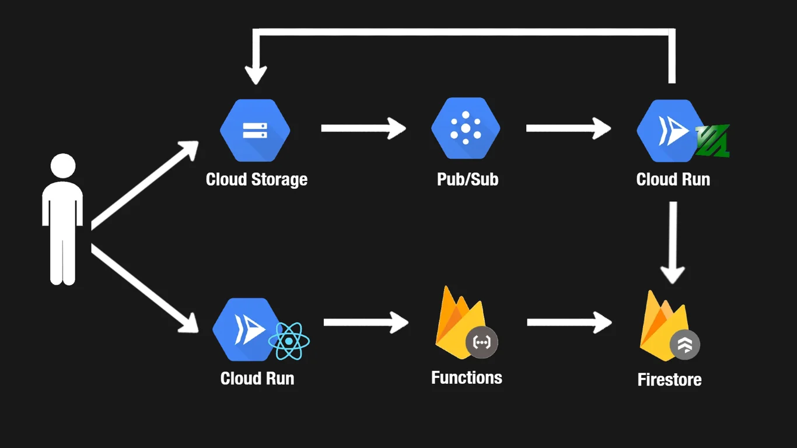

# my-tube

## YouTube Skeleton Clone

Welcome to the YouTube Skeleton Clone project! This is a simplified version of YouTube, focusing on core functionalities like video uploading and viewing. While it's not meant for production use, it's a great learning experience. Here's everything you need to know:

## Introduction

The YouTube Skeleton Clone is my personal project, inspired by the iconic video-sharing platform, YouTube. It's designed to replicate some fundamental features of YouTube while keeping things simple and educational. I've removed the details about the course to give it a personal touch.

## Background

YouTube is a massive platform with numerous features, even the seemingly straightforward ones like video rating and commenting are complex at its scale. In this project, we'll primarily focus on video uploading and viewing.

## Requirements

**User Authentication:**
- Users can sign in and out using their Google accounts.

**Video Upload:**
- Authenticated users can upload videos.
- Uploaded videos are transcoded into multiple formats (e.g., 360p, 720p).

**Video Viewing:**
- Users can view a list of uploaded videos, whether signed in or not.
- Users can watch individual videos, signed in or not.

## High-Level Design

Here's an overview of the high-level architecture and the cloud services we'll use:

**Video Storage (Cloud Storage):**
We'll host raw and processed videos on Google Cloud Storage. It's scalable and cost-effective for storing large files.

**Video Upload Events (Cloud Pub/Sub):**
Whenever a video is uploaded, a message is published to a Cloud Pub/Sub topic. This provides durability for video upload events and allows for asynchronous processing.

**Video Processing Workers (Cloud Run):**
Video processing workers receive messages from Pub/Sub and transcode videos using FFmpeg, a popular open-source tool. Cloud Run autoscales to handle varying workloads, and processed videos are stored back in Cloud Storage.

**Video Metadata (Firestore):**
After processing, video metadata is stored in Firestore. This includes details like title and description, enabling us to display videos on the web client.

**Video API (Firebase Functions):**
Firebase Functions create a simple API for uploading videos and retrieving video metadata. This can be extended to support CRUD operations.

**Web Client (Next.js / Cloud Run):**
We'll build a user-friendly web client using Next.js for signing in and uploading videos. This client will be hosted on Cloud Run.

**Authentication (Firebase Auth):**
Firebase Auth handles user authentication, making it easy to integrate Google Sign-In.

## Detailed Design

### 1. User Sign-Up
Users can sign up using their Google accounts, managed by Firebase Auth. A Firestore document is created for each user, allowing us to store additional user information like name and profile picture.

### 2. Video Upload
Video uploads are limited to authenticated users. To prevent unauthorized uploads, we generate a signed URL that allows users to upload directly to Cloud Storage. This URL generation is handled by a Firebase Function, ensuring user authentication before URL generation.

### 3. Video Processing
To handle video processing efficiently, we introduce a message queue using Cloud Pub/Sub. Benefits include decoupling upload from processing, message buffering, and potential future scalability for analytics. Processed videos and metadata are stored in Cloud Storage and Firestore, respectively.

## Limitations

### 1. Long Lived HTTP Requests (Pub/Sub and Cloud Run)

Our architecture currently faces a challenge with the time constraints of Pub/Sub (max ack deadline of 600 seconds) and Cloud Run (max request processing time of 3600 seconds). If video processing takes longer than 600 seconds, Pub/Sub will close the HTTP connection, potentially causing messages to be stuck in the queue indefinitely. This situation could be resolved by switching to the Pull Subscription method. With Pull, we can control when messages are retrieved, processed, and acknowledged, preventing messages from getting stuck in the queue.

### 2. Video Processing Failure

In the event of a video processing failure after a message has been pulled from the Pub/Sub queue and its status changed to "processing" in Firestore, the message could be stuck in the Pub/Sub queue indefinitely. We need to implement a mechanism to requeue messages in case of processing failures. One approach could be to reset the status to "undefined" and attempt processing again.

### 3. File Upload Time Limit

While our current 15-minute limit for signed URL validity might seem sufficient, it's worth noting that slower internet connections could potentially cause uploads to exceed this limit. However, the signed URL is only needed for authentication, and uploads can continue after its expiration. To improve security, we could consider shortening the signed URL's time limit, perhaps to just 1 minute.

### 4. Video Streaming

Our system relies on basic file streaming provided by Google Cloud Storage, which lacks the advanced capabilities of YouTube's custom video streaming and chunking solution using DASH (Dynamic Adaptive Streaming over HTTP) or HLS (HTTP Live Streaming). Implementing such streaming technology would enable adaptive quality selection and faster video startup times.

### 5. Content Delivery Network (CDN)

To enhance user experience by reducing latency, it would be ideal to serve videos from a Content Delivery Network (CDN). CDNs deliver content from servers geographically closer to users, improving video load times.

### 6. Illegal Videos

Our application currently lacks a mechanism for screening videos for illegal content before serving them to users. This presents a significant safety concern, making it risky to deploy the app publicly without moderation tools to filter out inappropriate content.

## Future Work

Here are some future enhancements and fixes that can be implemented to improve our YouTube Skeleton Clone:

1. **User Profile Information:** Add features to display users' profile pictures and email addresses on the web client, providing a more personalized experience.

2. **Multiple Video Uploads:** Address a bug that requires users to refresh the page after each video upload. Allow users to upload multiple videos without page refresh.

3. **Thumbnail Upload:** Enable users to upload custom thumbnails for their videos, enhancing video presentation.

4. **Video Metadata:** Implement a feature that allows users to add titles and descriptions to their uploaded videos, making videos more informative.

5. **Display Uploader:** Show the uploader's information alongside the video, making it easier for users to identify the content creator.

6. **User Subscriptions:** Allow users to subscribe to other users' channels, fostering a sense of community and interaction.

7. **Raw Video Cleanup:** Implement a mechanism to automatically clean up raw videos in Cloud Storage after they have been processed, optimizing resource usage.

8. **CDN Integration:** Incorporate a CDN to serve videos, reducing latency and enhancing the user experience.

9. **Testing:** Add unit and integration tests to ensure the reliability and functionality of the application.

## Conclusion

Thank you for your interest in the YouTube Skeleton Clone project! I hope you've found this journey informative and inspiring. Designing and architecting applications come with various challenges and trade-offs, and this project has provided valuable insights into those complexities.

Remember that there's no one-size-fits-all approach to application design. It's about finding the right balance between functionality, scalability, and user experience. If you decide to tackle some of the future work items or re-architect the app, you'll undoubtedly gain even more valuable experience in the world of software development.

## References

- [Firebase Auth Documentation](https://firebase.google.com/docs/auth)
- [Cloud Storage Signed URLs](https://cloud.google.com/storage/docs/access-control/signed-urls)
- [Pub/Sub Push Subscriptions](https://cloud.google.com/pubsub/docs/push)
- [Using Pub/Sub with Cloud Storage](https://cloud.google.com/storage/docs/pubsub-notifications)
- [Using Pub/Sub with Cloud Run](https://cloud.google.com/run/docs/tutorials/pubsub)

Feel free to explore this YouTube Skeleton Clone project, learn from it, and expand upon it as you see fit.